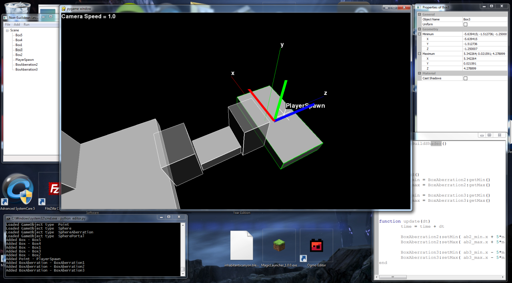

Azathoth
========

A level editor for non-euclidean worlds. Designed to be used with a real-time raytracer that I am developing.

Dependencies
------------
Make sure that you don't mix and match 64-bit and 32-bit versions of the dependencies and the python interpreter.

* Pygame - http://www.pygame.org/
* PyOpenGL - http://pyopengl.sourceforge.net/
* wxPython - http://wxpython.org/
* wxPropGrid - http://wxpropgrid.sourceforge.net/cgi-bin/index
